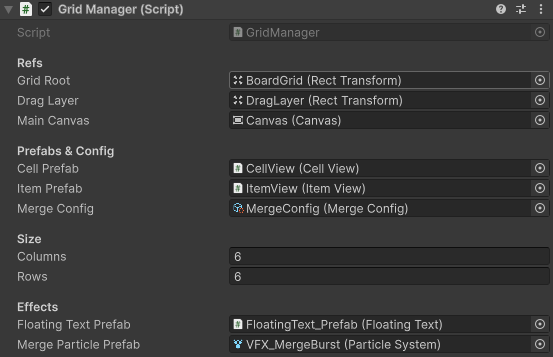

# Merge Gems: Forest Spirit 🌲💎

A high-polish mobile merge prototype built in Unity, focusing on satisfying "game feel" and scalable UI architecture.

<p align="center">
  
</p>

---

## 🎮 How to Play
1. **Spawn:** Tap the **SPAWN!** button to generate Tier 1 Forest Spirits on the grid.
2. **Merge:** Drag and drop identical spirits onto each other to evolve them into higher-tier gems.
3. **Progress:** Reach the **Level 6** goal shown at the top of the screen to unlock the next forest clearing.

---

## 🚀 Technical Highlights

### **1. The "Juice" System (Animation & Feedback)**
Instead of standard linear movements, I implemented a curve-based animation system:
* **Custom Easing:** Used `AnimationCurve` to drive item spawns and merges, creating a tactile, bouncy feel that mimics top-tier casual games.
* **Feedback Loops:** Created a dynamic floating text system that handles scaling, fading, and screen-edge clamping to ensure visibility on all device types.
* **UI Punch:** Implemented scale-pulsing on buttons and shop elements to provide immediate physical feedback to player input.

### **2. Architecture & Scalability**
* **Decoupled Logic:** Utilized a clean separation between the `GridManager` (data/logic) and `ItemView` (visuals/animations).
* **Mobile Optimization:** * Configured the `Canvas Scaler` for width-dominant scaling to support "tall" aspect ratios (e.g., Pixel 8, iPhone 15).
    * Integrated a drop-shadow system that dynamically updates based on the current item's sprite.
* **Extensible Item System:** The project uses a level-based sprite swapping logic, allowing for easy addition of new merge tiers without modifying core code.

---

## 🛠️ Tech Stack
* **Engine:** Unity 2022.3+ (LTS)
* **Language:** C#
* **Graphics:** 2D Sprite-based with dynamic UI Glow and Shadow components.

---

## 📂 Directory Structure

A brief overview of the key folders in this project:

```text
/Assets
  /Scripts
    /Core          <-- GridManager, LevelLogic, GameStates
    /View          <-- ItemView, AnimationController, ParticleSystems
    /UI            <-- CanvasManagement, ButtonPulser, FloatingText
  /Prefabs         <-- Reusable Spirit Items and UI elements
  /Art
    /Sprites       <-- Gem Tiers, Forest Backgrounds
    /Animations    <-- AnimationCurves and Clip data
```

---

## 📸 Developer Showcase

### **The "Juice" in Action**
*A look at the custom AnimationCurves driving the merge feel:*
<p align="center">
  
</p>

### **UI Architecture**
*Visualizing the decoupled Grid vs View relationship:*
<p align="center">
  
</p>
