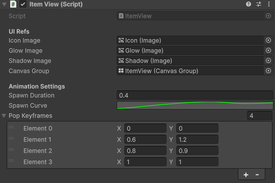

# Merge Gems: Forest Spirit 🌲💎

A high-polish mobile merge prototype built in Unity, focusing on satisfying "game feel" and scalable UI architecture.

  

---

## 🚀 Technical Highlights

### **1. The "Juice" System (Animation & Feedback)**
Instead of standard linear movements, I implemented a curve-based animation system:
* **Custom Easing:** Used `AnimationCurve` to drive item spawns and merges, creating a tactile, bouncy feel that mimics top-tier casual games.
* **Feedback Loops:** Created a dynamic floating text system that handles scaling, fading, and screen-edge clamping to ensure visibility on all device types.
* **UI Punch:** Implemented scale-pulsing on buttons and shop elements to provide immediate physical feedback to player input.

### **2. Architecture & Scalability**
* **Decoupled Logic:** Utilized a clean separation between the `GridManager` (data/logic) and `ItemView` (visuals/animations).
* **Mobile Optimization:** * Configured the `Canvas Scaler` for width-dominant scaling to support "tall" aspect ratios (e.g., Pixel 8, iPhone 15).
    * Integrated a drop-shadow system that dynamically updates based on the current item's sprite.
* **Extensible Item System:** The project uses a level-based sprite swapping logic, allowing for easy addition of new merge tiers without modifying core code.

---

## 🛠️ Tech Stack
* **Engine:** Unity 2022.3+ (LTS)
* **Language:** C#
* **Graphics:** 2D Sprite-based with dynamic UI Glow and Shadow components.

---

## 📸 Developer Showcase

  
   
  <em>Example of the AnimationCurve driving the 'Spawn' and 'Merge' juice.</em>

